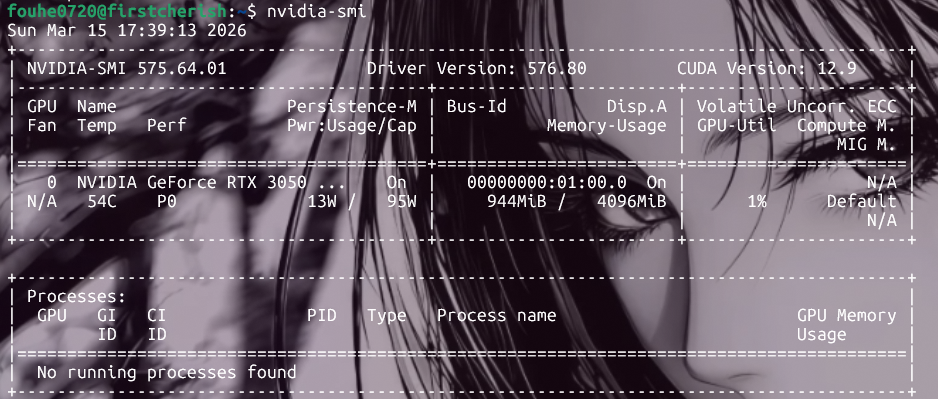

#### conda、CUDA、cuDNN 分别是什么？有什么用？

##### 1. Conda
   
定义：跨平台的包管理器 + 环境管理器(Anaconda/Miniconda的核心),不是只管理 Python，还能管理 C/C++、R 等语言的依赖包。

核心作用：

解决**包版本冲突**：比如项目A需要Python3.8 + TensorFlow 2.8，项目B需要 Python3.10 +TensorFlow2.15，用Conda可创建隔离的虚拟环境，互不干扰。
可以一键安装复杂依赖：很多科学计算和深度学习包(PyTorch)的依赖链很长，Conda能自动解决依赖关系。


##### 2. CUDA
定义：NVIDIA推出的并行计算平台+编程模型，是打通CPU和GPU的桥梁。

核心作用：

可以让开发者能利用NVIDIA GPU的并行计算能力，加速密集型计算任务(比如深度学习的矩阵运算、科学计算)。

简单说：没有CUDA，GPU就无法被深度学习框架(TensorFlow/PyTorch)调用，只能用CPU 跑速度会慢很多。此外WSL中无需安装NVIDIA显卡驱动(驱动装在Windows侧)，只需要安装CUDA Toolkit(cuda工具包)


##### 3. cuDNN

定义：CUDA Deep Neural Network library(基于CUDA的深度学习加速库)，NVIDIA专为神经网络优化的底层库。

核心作用：
对深度学习的核心操作(卷积、池化、激活函数、矩阵乘)做了极致的GPU加速优化，是 TensorFlow/PyTorch等框架的必备底层依赖。

没有cuDNN，深度学习框架也能跑CUDA，但速度会大幅下降(相当于 GPU 没发挥出深度学习的专属优化)。**注意cuDNN版本必须和CUDA版本严格匹配。**


#### 安装方式
在WSL 2中安装CUDA环境,有一个最核心的原则需要先理解:WSL2复用了Windows主机上安装的NVIDIA驱动程序。判断是否已经有了适配wsl的驱动程序的方法是:
打开Ubuntu输入指令:
```
nvidia-smi
```
显示如图类似信息即说明成功:


如图说明了我的驱动程序最高可兼容到12.9的cuda版本后面我们按照这个要求去装就行。

##### CUDA Toolkit安装
这里安装CUDA 12.8 Toolkit

```
# 下载并安装 NVIDIA CUDA 密钥环
wget https://developer.download.nvidia.com/compute/cuda/repos/ubuntu2404/x86_64/cuda-keyring_1.1-1_all.deb
sudo dpkg -i cuda-keyring_1.1-1_all.deb

# 更新软件源列表
sudo apt-get update

# 安装 CUDA Toolkit 12.8 
sudo apt-get -y install cuda-toolkit-12-8
```

然后就是配置环境变量，让系统能找到CUDA命令和库

```
echo -e "\nexport PATH=/usr/local/cuda-12.8/bin:\$PATH\nexport LD_LIBRARY_PATH=/usr/local/cuda-12.8/lib64:\$LD_LIBRARY_PATH\nexport CUDA_HOME=/usr/local/cuda-12.8" >> ~/.bashrc && source ~/.bashrc
```

然后输入验证指令观察输出就好啦：

```
nvcc -V
```


##### cuDNN安装
完成上面cudatoolkit安装再安装cuDNN。

CUDA 12.x与cuDNN 9.x系列完美兼容,我们可通过apt来安装它。

```
sudo apt-get -y install cudnn
```

然后依旧验证下安装：

```
ls /usr/lib/x86_64-linux-gnu/libcudnn*
```

这个指令检查cuDNN库文件是否存在。如果看到类似libcudnn.so和libcudnn.so.9的文件，则表示安装成功。


##### conda安装

这里直接用wegt下载最新版的Miniconda Linux版本。

```
wget https://repo.anaconda.com/miniconda/Miniconda3-latest-Linux-x86_64.sh
```

下载下来后我们运行其中的安装脚本实现安装:

```
bash Miniconda3-latest-Linux-x86_64.sh
```


最后为了让conda生效加入环境变量便于每次启动conda命令可用执行:

```
source ~/.bashrc
```


##### 大模型训练环境配置

###### 1.虚拟环境创建与pytorch安装
首先用conda创建一个指定的python版本的虚拟环境llm并且要激活，后续安装都需要在这个虚拟环境下进行。

```
虚拟环境安装：
conda create -n llm python=3.11 -y

激活环境:
conda activate llm
```

然后是安装PyTorch及相关库：
(CUDA驱动是向后兼容的，即用CUDA 12.4编译的程序可以在12.8驱动上完美运行。)


```
pip install torch torchvision torchaudio --index-url https://download.pytorch.org/whl/cu124

觉得慢可以用镜像源:
pip install torch torchvision torchaudio -i https://pypi.mirrors.ustc.edu.cn/simple/
```


验证PyTorch和CUDA是否正常工作：

```
python -c "import torch; print('PyTorch版本:', torch.__version__); print('CUDA可用:', torch.cuda.is_available()); print('CUDA版本:', torch.version.cuda)"
```


###### 2.大模型训练相关

为了便于后续安装,我们可以在激活的虚拟环境中对pip设置镜像源加速安装,这里推荐中科大镜像源：
(很多工具如pip、conda、npm、Docker等的官方服务器都在国外,我们下载很容易超时。而镜像源就是国内公司或者大学把官方仓库完整同步一份，放在国内服务器上,让我们可以高速、稳定下载。)


```
pip config set global.index-url https://pypi.mirrors.ustc.edu.cn/simple/
```

验证：
```
pip config get global.index-url
```

后续要换回官方源也很简单:

```
pip config unset global.index-url
```

1. 安装ninja

    这是Flash Attention编译必备的,它用于加速CUDA代码编译,没有它 FlashAttention要编译速度大大提升。

```
pip install ninja

# 验证 ninja 是否正常工作
ninja --version && echo $?   # 应该返回 0

```

2. 安装Flash Attention 2
   这是注意力机制加速器。可以让大模型训练速度翻倍、显存占用减半。


```
# pip安装(会自动从源码编译，依赖上面装的 ninja)

pip install flash-attn --no-build-isolation

# 如果你的内存较小(比如 16GB)，可以限制并行编译任务数：

MAX_JOBS=2 pip install flash-attn --no-build-isolation

#安装后验证

python -c "from flash_attn import flash_attn_func; print('Flash Attention 导入成功')"
```


3. 安装Unsloth
   这是大模型微调神器。在保持精度的前提下,可以训练速度提升、显存减少,支持Llama、Qwen等主流模型。
   

```
pip install unsloth

```

有一点值得注意在使用时要在Python脚本开头先导入Unsloth，再导入其他库！


4. 安装Hugging Face全家桶(Transformers, Datasets, Accelerate)
   
   其中transformers：模型库，加载和调用成千上万的预训练模型;datasets：数据集处理，快速加载和处理训练数据;accelerate：分布式训练辅助，可以在单机/多卡间无缝切换。


```
pip install transformers datasets accelerate evaluate tensorboard
```


5. 安装DeepSpeed
   
   可以选择性安装它。它本身是分布式训练框架。可以在一张卡上训练大模型(ZeRO优化)、或者在多卡上并行训练。
   对我们的个人笔记本的使用,它有一个功能叫:ZeRO-Offload：当你训练的模型太大，一张显卡装不下时。DeepSpeed可以把优化器状态和梯度卸载到CPU内存，只保留模型参数在GPU上。这样你就能在显存有限的笔记本上，训练原本装不下的更大模型。


```
pip install deepspeed
```

