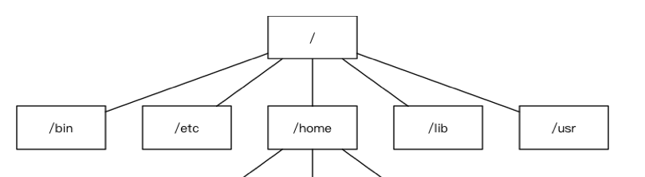

#### 1. wsl(Windows Subsystem for Linux)

这是微软给Windows系统做的Linux兼容层,能让你在Windows里直接运行Linux系统和命令。

安装方式:
管理员PowerShell执行: 
```
wsl --install
```

然后继续安装Ubuntu(可以指定版本，这里默认最新)
```
wsl --install -d Ubuntu
```

tips：Ubuntu默认安装在c盘下面几步可以直接切换到其它盘：
```
关闭所有运行中的WSL实例
1.wsl --shutdown   

导出当前Ubuntu到E盘备份
2.wsl --export Ubuntu E:\WSL\ubuntu_backup.tar

注销C盘的Ubuntu
3.wsl --unregister Ubuntu

把备份导入到E盘目标目录
4.wsl --import Ubuntu E:\WSL\Ubuntu E:\WSL\ubuntu_backup.tar --version 2

启用下Ubuntu就可以开始用了
5.wsl -d Ubuntu 
```

做完这几步linux实际数据就存在E盘的WSL\Ubuntu\ext4.vhdx虚拟磁盘里。


#### 2. vscode+wsl

考虑到本地Windows环境和服务器和部署的Linux环境不一致,避免本地能跑的代码在linux中不适用,这里直接把vscode连接到wsl(vscode中有wsl插件支持)。这样一来我们可以用熟悉的VSCode界面写代码，代码实际存在WSL(Linux)里,提升开发效率。


#### 3. 基础知识

##### 操作系统

概念：

操作系统是直接运行在计算机上的系统软件，它是控制硬件和支持软件运行的计算机程序。向下控制硬件向上支持软件运行。

Windows操作系统有可能会有多个盘符但是Ubuntu操作系统是属于Linux操作系统中的一种，Ubuntu没有盘符这个概念，只有一个根目录 / 。




其中
1. /bin —— 基础命令仓库 
全称：binary（二进制）
作用：存放系统最核心的可执行命令，是保证系统能正常启动和运行的基础命令。
例子：你在终端里用的 ls（看目录）、cp（复制文件）、mv（移动文件）、rm（删除文件）都在这里。

2. /etc —— 系统配置中心 
全称：et cetera（最初意为 “杂项”，现在是系统配置的代名词）
作用：存放所有系统级的配置文件，是 Linux 的 “控制面板”。
例子：用户账号密码（/etc/passwd）、网络配置（/etc/network）、SSH 服务配置（/etc/ssh）、软件的全局设置都在这里。

3. /home —— 你的个人地盘 
作用：存放所有普通用户的个人数据，每个用户对应一个子目录。
内容：你的代码、文档、下载文件、个人配置都在这里。
特点：你拥有完全的读写权限，日常开发、存文件都只需要操作这个目录，相当于 Windows 的「我的文档 + 桌面 + 用户目录」。

4. /lib —— 共享库仓库 
全称：library（库）
作用：存放系统共享的库文件，是 /bin、/sbin 等目录里命令运行时依赖的 “代码插件”。
例子：C 语言标准库、驱动程序依赖的库文件都在这里，保证系统命令和软件能正常运行。
特点：普通用户不需要直接操作，系统会自动管理。

5. /usr —— 系统资源仓库 
全称：最初是 user（用户），现在是 Unix System Resources（Unix 系统资源）
作用：是系统的「第二根目录」，存放系统级应用程序、库、文档、帮助手册等。
子目录例子：
/usr/bin：更多系统命令（比 /bin 更全）
/usr/local：你手动安装的软件（比如自己编译的程序）
/usr/share：共享数据（比如帮助文档、图标）


自己开发一般就关注/home目录即可。


###### linux内核
Linux内核是操作系统内部操作和控制硬件设备的核心程序，真正操作和控制硬件是由内核来完成的，操作系统是基于内核开发出来的。

linux发行版(比如Ubuntu)是Linux内核与各种常用软件的组合产品，通俗来说就是我们常说的Linux操作系统。


##### linux基础/高级命令速查
1. 查看目录命令

| 命令 | 解释 | 示例 |
|------|------|------|
| `ls` | 列出目录内容 | `ls -l /home` 列出/home目录的详细信息 |
| `pwd` | 显示当前工作目录的绝对路径 | `pwd` 输出当前目录路径，如 `/home/user` |

2. 切换目录命令

| 命令 | 解释 | 示例 |
|------|------|------|
| `cd` | 切换工作目录 | `cd /etc` 切换到/etc目录；`cd ..` 返回上一级目录；`cd ~` 切换到用户主目录 |

3. 绝对路径和相对路径

| 命令 | 解释 | 示例 |
|------|------|------|
| `cd` | 使用绝对路径切换目录 | `cd /usr/local/bin` |
| `cd` | 使用相对路径切换目录 | `cd ../../etc` 从当前目录向上两级进入etc |
| `ls` | 使用绝对路径列出目录 | `ls /var/log` |
| `ls` | 使用相对路径列出目录 | `ls ./doc` 列出当前目录下的doc目录 |

4. 创建、删除文件及目录命令

| 命令 | 解释 | 示例 |
|------|------|------|
| `touch` | 创建空文件或更新文件时间戳 | `touch file.txt` 创建file.txt文件 |
| `mkdir` | 创建目录 | `mkdir newdir` 创建newdir目录；`mkdir -p a/b/c` 递归创建多级目录 |
| `rm` | 删除文件或目录 | `rm file.txt` 删除文件；`rm -r dir` 递归删除目录及其内容 |
| `rmdir` | 删除空目录 | `rmdir emptydir` 删除空目录 |

5. 复制、移动文件及目录命令

| 命令 | 解释 | 示例 |
|------|------|------|
| `cp` | 复制文件或目录 | `cp file1.txt file2.txt` 复制文件；`cp -r dir1 dir2` 递归复制目录 |
| `mv` | 移动或重命名文件/目录 | `mv oldname.txt newname.txt` 重命名；`mv file.txt /tmp/` 移动文件到/tmp |

6. 终端命令格式的组成

| 组成部分 | 解释 | 示例 |
|----------|------|------|
| 命令 | 要执行的程序名 | `ls` |
| 选项 | 调整命令行为的参数，通常以`-`开头 | `-l` (长格式), `-a` (显示所有文件) |
| 参数 | 命令作用的对象，如文件、目录等 | `/home` |

7. 查看命令帮助

| 命令 | 解释 | 示例 |
|------|------|------|
| `man` | 显示命令的手册页 | `man ls` 查看ls命令的详细手册 |
| `命令 --help` | 显示命令的简要帮助信息 | `ls --help` 显示ls命令的帮助概要 |
| `whatis` | 显示命令的简短描述 | `whatis ls` 输出ls的一行描述 |
| `info` | 显示命令的info文档 | `info ls` 查看ls的info文档 |

8. ls命令选项

| 命令 | 解释 | 示例 |
|------|------|------|
| `ls -l` | 以长格式显示文件详细信息 | `ls -l` |
| `ls -a` | 显示所有文件，包括隐藏文件（以.开头的） | `ls -a` |
| `ls -h` | 与-l结合，以人类可读方式显示文件大小 | `ls -lh` |
| `ls -R` | 递归显示子目录内容 | `ls -R /etc` |
| `ls -t` | 按修改时间排序 | `ls -lt` |
| `ls -r` | 反向排序 | `ls -lr` |
| `ls -S` | 按文件大小排序 | `ls -lS` |

9. mkdir和rm命令选项

| 命令 | 解释 | 示例 |
|------|------|------|
| `mkdir -p` | 递归创建目录，如果父目录不存在则自动创建 | `mkdir -p parent/child/grandchild` |
| `mkdir -m` | 创建目录时设置权限模式 | `mkdir -m 755 newdir` |
| `rm -r` | 递归删除目录及其内容 | `rm -r dir/` |
| `rm -f` | 强制删除，忽略不存在的文件，不提示 | `rm -f file.txt` |
| `rm -i` | 交互式删除，每次删除前提示 | `rm -i file.txt` |

10. cp和mv命令选项

| 命令 | 解释 | 示例 |
|------|------|------|
| `cp -r` | 递归复制目录 | `cp -r dir1/ dir2/` |
| `cp -i` | 交互式复制，覆盖前提示 | `cp -i file1.txt file2.txt` |
| `cp -u` | 仅在源文件比目标文件新或目标不存在时复制 | `cp -u source dest` |
| `cp -a` | 归档复制，保留文件属性（等同于-dpR） | `cp -a dir1/ dir2/` |
| `mv -i` | 交互式移动，覆盖前提示 | `mv -i file.txt /tmp/` |
| `mv -u` | 仅在源文件比目标文件新或目标不存在时移动 | `mv -u file.txt /tmp/` |
| `mv -v` | 显示详细的移动信息 | `mv -v file.txt /tmp/` |

11. 重定向命令

| 命令/符号 | 解释 | 示例 |
|-----------|------|------|
| `>` | 将命令的标准输出重定向到文件，覆盖原内容 | `ls > filelist.txt` 将ls输出写入filelist.txt |
| `>>` | 将命令的标准输出重定向到文件，追加到文件末尾 | `echo "hello" >> file.txt` |
| `<` | 将文件内容作为命令的输入 | `wc -l < file.txt` 统计file.txt的行数 |
| `2>` | 将命令的错误输出重定向到文件 | `grep root /etc/passwd 2> error.log` |
| `&>` | 将标准输出和错误输出都重定向到文件 | `ls /nonexist &> output.txt` |
| `\|` | 管道符，将前一个命令的输出作为后一个命令的输入 | `ls -l \| grep "txt"` |

12. 查看文件内容命令

| 命令 | 解释 | 示例 |
|------|------|------|
| `cat` | 连接文件并打印到标准输出 | `cat file.txt` 显示文件内容 |
| `less` | 分页查看文件内容（支持上下翻页） | `less largefile.log` |
| `more` | 分页查看文件内容（只能向下翻页） | `more file.txt` |
| `head` | 显示文件开头几行（默认10行） | `head -n 20 file.txt` 显示前20行 |
| `tail` | 显示文件末尾几行（默认10行） | `tail -f logfile` 动态跟踪文件增长 |
| `nl` | 显示文件内容并添加行号 | `nl file.txt` |
| `tac` | 反向显示文件内容（最后一行在前） | `tac file.txt` |

13. 链接命令

| 命令 | 解释 | 示例 |
|------|------|------|
| `ln` | 创建硬链接 | `ln file1.txt file2.txt` 创建file1.txt的硬链接file2.txt |
| `ln -s` | 创建软链接（符号链接） | `ln -s /original/path linkname` |

14. 文本搜索命令

| 命令 | 解释 | 示例 |
|------|------|------|
| `grep` | 在文件中搜索匹配指定模式的行 | `grep "error" logfile.txt` |
| `grep -i` | 忽略大小写 | `grep -i "warning" log.txt` |
| `grep -r` | 递归搜索目录 | `grep -r "main" /home/user/code/` |
| `grep -v` | 显示不匹配的行 | `grep -v "debug" log.txt` |
| `grep -n` | 显示匹配行的行号 | `grep -n "TODO" script.sh` |

15. 查找文件命令

| 命令 | 解释 | 示例 |
|------|------|------|
| `find` | 在目录树中查找文件 | `find /home -name "*.txt"` 查找所有.txt文件 |
| `locate` | 通过数据库快速查找文件（需updatedb更新） | `locate myfile.txt` |

16. 压缩和解压缩命令

| 命令 | 解释 | 示例 |
|------|------|------|
| `tar` | 打包或解包文件（常与压缩结合） | `tar -czf archive.tar.gz /path` 创建tar.gz压缩包；`tar -xzf archive.tar.gz` 解压 |
| `gzip` | 压缩文件（生成.gz文件） | `gzip file.txt` 压缩为file.txt.gz |
| `gunzip` | 解压.gz文件 | `gunzip file.txt.gz` |
| `zip` | 创建zip压缩包 | `zip archive.zip file1 file2` |
| `unzip` | 解压zip文件 | `unzip archive.zip` |

17. 文件权限命令

| 命令 | 解释 | 示例 |
|------|------|------|
| `chmod` | 修改文件或目录的权限 | `chmod 755 script.sh` 设置权限rwxr-xr-x；`chmod u+x file` 给所有者添加执行权限 |
| `chown` | 修改文件或目录的所有者和组 | `chown user:group file.txt` 将文件所有者改为user，组改为group |
| `chgrp` | 修改文件或目录的所属组 | `chgrp staff file.txt` |

18. 获取管理员权限的相关命令

| 命令 | 解释 | 示例 |
|------|------|------|
| `sudo` | 以其他用户（默认为root）身份执行命令 | `sudo apt update` 更新软件包列表 |
| `su` | 切换用户身份 | `su -` 切换到root用户并加载环境；`su username` 切换到指定用户 |

19. 用户相关操作

| 命令 | 解释 | 示例 |
|------|------|------|
| `useradd` | 创建新用户 | `sudo useradd -m newuser` 创建用户并创建家目录 |
| `usermod` | 修改用户属性 | `sudo usermod -aG sudo newuser` 将用户添加到sudo组 |
| `userdel` | 删除用户 | `sudo userdel -r newuser` 删除用户并删除家目录 |
| `passwd` | 修改用户密码 | `passwd` 修改当前用户密码；`sudo passwd newuser` 修改指定用户密码 |

20. 用户组相关操作

| 命令 | 解释 | 示例 |
|------|------|------|
| `groupadd` | 创建新用户组 | `sudo groupadd developers` |
| `groupmod` | 修改用户组属性 | `sudo groupmod -n newname oldname` 重命名组 |
| `groupdel` | 删除用户组 | `sudo groupdel developers` |
| `gpasswd` | 管理组密码和成员 | `sudo gpasswd -a username developers` 将用户添加到组 |

21. 远程登录、远程拷贝命令

| 命令 | 解释 | 示例 |
|------|------|------|
| `ssh` | 远程登录到另一台主机 | `ssh user@hostname` 登录远程主机 |
| `scp` | 基于SSH的远程复制文件 | `scp file.txt user@host:/path/` 复制本地文件到远程 |
| `rsync` | 远程同步文件，支持增量传输 | `rsync -avz /local/dir/ user@host:/remote/dir/` 同步目录 |

22. 编辑器vim

| 命令 | 解释 | 示例 |
|------|------|------|
| `vim` | 打开Vim编辑器 | `vim file.txt` 编辑文件；按`i`进入插入模式，`:wq`保存退出，`:q!`不保存退出 |

23. 软件安装

| 命令 | 解释 | 示例 |
|------|------|------|
| `apt install` | 安装软件包（Debian/Ubuntu） | `sudo apt install package` |
| `yum install` | 安装软件包（RHEL/CentOS 7） | `sudo yum install package` |
| `dnf install` | 安装软件包（Fedora/RHEL 8+） | `sudo dnf install package` |
| `pacman -S` | 安装软件包（Arch Linux） | `sudo pacman -S package` |

24. 软件卸载

| 命令 | 解释 | 示例 |
|------|------|------|
| `apt remove` | 卸载软件包（保留配置文件） | `sudo apt remove package` |
| `apt purge` | 彻底卸载软件包（删除配置文件） | `sudo apt purge package` |
| `yum remove` | 卸载软件包 | `sudo yum remove package` |
| `dnf remove` | 卸载软件包 | `sudo dnf remove package` |
| `pacman -R` | 卸载软件包 | `sudo pacman -R package` |


